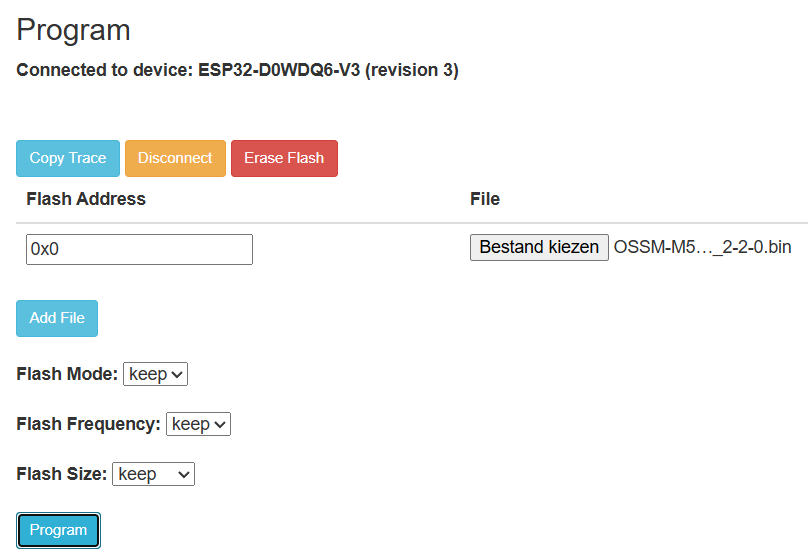

# Install Instructions

1. Open the ESP Web Flasher: https://espressif.github.io/esptool-js/
2. Connect your M5 device with a USB cable.
3. Click **Connect** and pick the correct COM port.
4. Select the matching firmware file for your device:
   - `OSSM-M5-Remote_m5stack-core2_TEST-v0-92.bin`
   - `OSSM-M5-Remote_m5stack-cores3_TEST-v0-92.bin`
5. For Flash Address choose 0x0 (flash offset `0x0000`).
6. Click **Program / Flash** and wait until it finishes.

After flashing, reboot the device.

Below you can see how your screen should look like using esptool:

