# OSSM M5 Remote User Manual

This guide is for daily use.
It is written for end users: simple, visual, and practical.

## Before You Start

1. Charge your M5 Remote.
2. Power on your OSSM.
3. Keep your hand close to the M5 buttons during first tests.

> [!TIP]
> Start every new setup with low speed, low depth, and low stroke.

## Quick Online Flash (Web Flasher)

You can flash firmware directly from browser.

Open:
- [Web flasher page](../../webflasher/index.html)

Steps:
1. Connect your M5 with a USB data cable.
2. Select your board (Core2 or CoreS3).
3. Click Install.
4. Select the COM/serial port.
5. Wait for flash to finish, then reboot the device.

> [!TIP]
> Use Chrome or Edge on desktop for best compatibility.

> [!WARNING]
> Always select the correct board type before flashing.

---

## Controls Quick Guide

- Left encoder: rotate + click
- Middle encoder (MX): rotate + click
- Right encoder: rotate + click
- Touchscreen buttons: same actions as on-screen labels
- Touchscreen is disabled in motion control screens for safety

In this manual:
- Left button = bottom-left button on the active screen
- Middle button = bottom-middle button
- Right button = bottom-right button

---

## Start Screen (Connect)

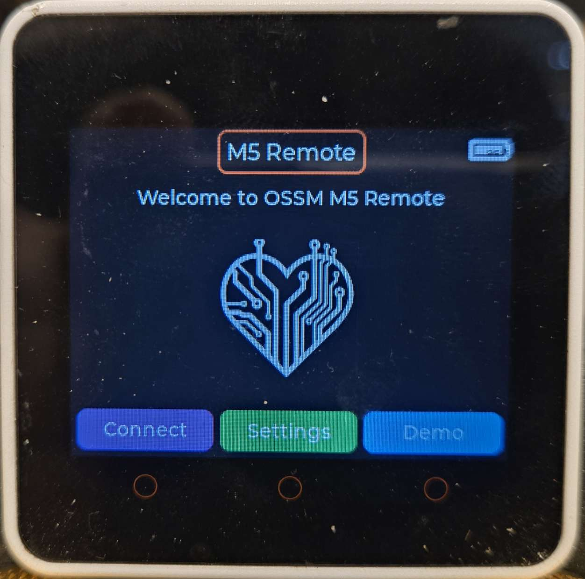

Use this screen to connect your remote.

What to do:
1. Press Connect (or wait for auto-connect).
2. After connection, the remote opens the Menu screen.

Buttons:
- Left: Connect
- Middle: open Settings
- Right: open Home (demo/manual path)

> [!TIP]
> If connection fails, retry once with OSSM powered and nearby.

---

## Menu Screen

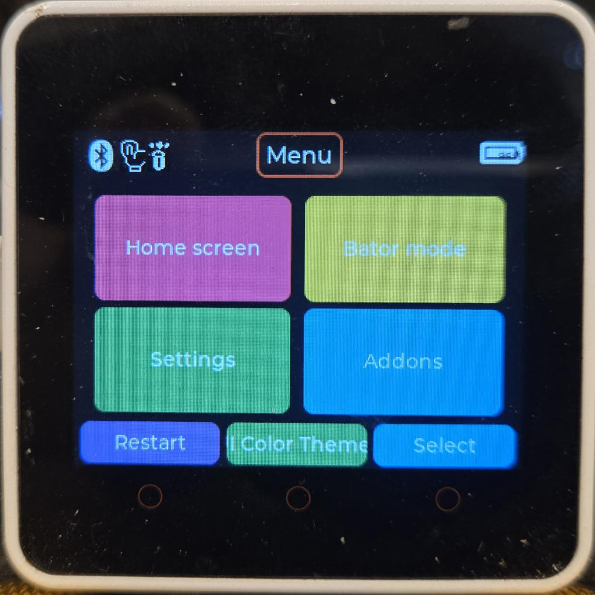

This is your navigation hub.

Main tiles:
- Home (OSSM control)
- Bator mode
- Settings
- Addons

Bottom buttons:
- Left: Restart remote (with confirmation)
- Middle: Colors / UI themes
- Right: Select focused tile

How to navigate:
1. Rotate right encoder to move focus.
2. Press right button to open selected tile.

---

## Home Screen (OSSM Control)

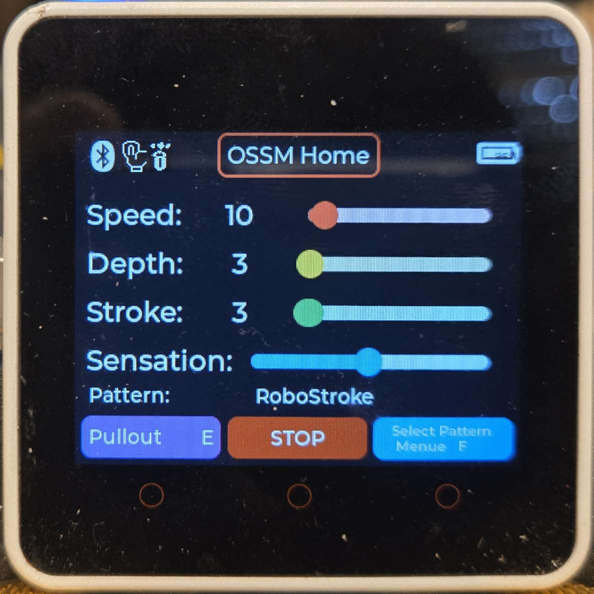

This is the main OSSM control screen.

Encoders:
- Encoder 1: Speed
- Encoder 2: Depth
- Encoder 3: Stroke
- Encoder 4: Sensation

Behavior:
- If speed, depth, and stroke are all above 0, your OSSM can run (auto start feature).
- If one of them goes to 0, your OSSM stops.

Buttons:
- Left: Pull-out
- Middle: Start/Stop (pause)
- Right: Pattern screen

Long press actions:
- Middle long press: Emergency stop and return path
- Left long press: open Eject screen (if enabled/paired)
- Right long press: open Fist-IT screen (if enabled/paired)

> [!WARNING]
> Emergency stop can still create movement while retracting. Keep clear and stay attentive.

---

## Bator Mode

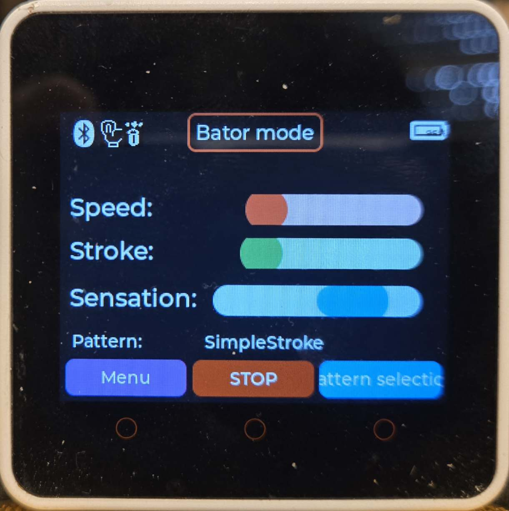

Bator mode is optimized for stroker-style movement around center.

Difference vs Home:
- Home: classic OSSM depth/stroke behavior
- Bator mode: stroke is centered around mid rail and behaves differently for sleeve-style use

Typical use:
- Set speed
- Set stroke
- Set sensation
- Start with middle button

Buttons:
- Left: back to Menu
- Middle: Start/Stop
- Right: Pattern screen

---

## Pattern Screen

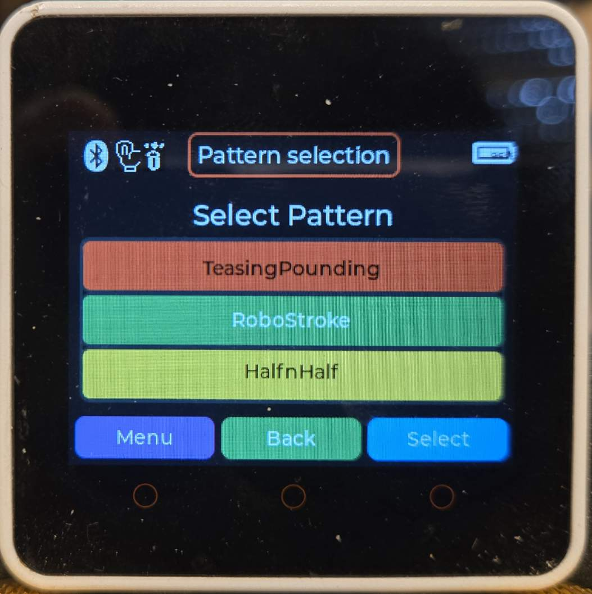

Use this screen to choose an OSSM pattern.

How to use:
1. Rotate right encoder to browse patterns.
2. Press right button to save and apply.

Buttons:
- Left: back to Menu
- Middle: return to previous control screen
- Right: Save (apply) selected pattern. This returns you to he previous screen. Sensation will be reset.

---

## Settings Screen

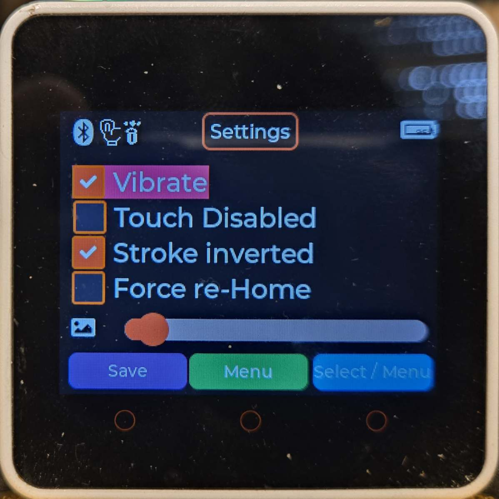

Use Settings to configure behavior and safety.

Main options:
- Vibrate: haptic feedback on interactions
- Safe Start/Stop: safer start behavior (speed will ramp up instead of immediately applied)
- Stroke invert: reverse stroke encoder direction
- Force re-home: enforce re-home on specific screen transitions. If unselected, ignores homeing procedure when switching between motion control screens like Home and Batormode.
- Speed behaviour: Standard / Natural / Tamed. On shorter strokes, speed behaviour can be too rappid. Changing this setting makes this 'feel' more natural or even tamed.
- Stroke affects depth: unselected: stroke can never be more than depth, selected: a higher stroke makes depth increase too.
- Encoder ramp: None / Medium / High / Aggressive (how fast encoder turns respond/relate to values)
- Brightness: adjust screen brightness. Rotate 3rd encoder to change

Buttons:
- Left: Save settings
- Middle: Back to Menu
- Right encoder click: toggle/cycle selected setting

About Speed behaviour:
- Standard: checkbox appears off
- Natural: checkbox appears on
- Tamed: checkbox appears on

> [!TIP]
> Natural is a good default for smoother speed vs stroke feel.

> [!WARNING]
> Force re-home MUST be selected when using IHSV motors, can be unselected with Gold motors. Keep Force re-home enabled unless you clearly understand your setup and risks.

---

## Colors / UI Themes

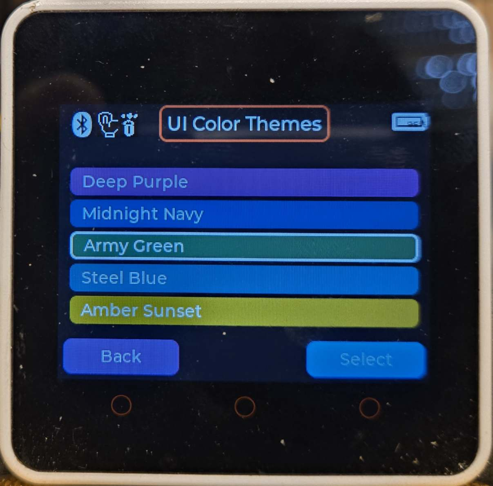

Change visual theme colors.

How to use:
1. Rotate right encoder to browse themes.
2. Press right button to apply selected theme.

Buttons:
- Left: back to Menu
- Right: apply selected theme

---

## Addons Screen

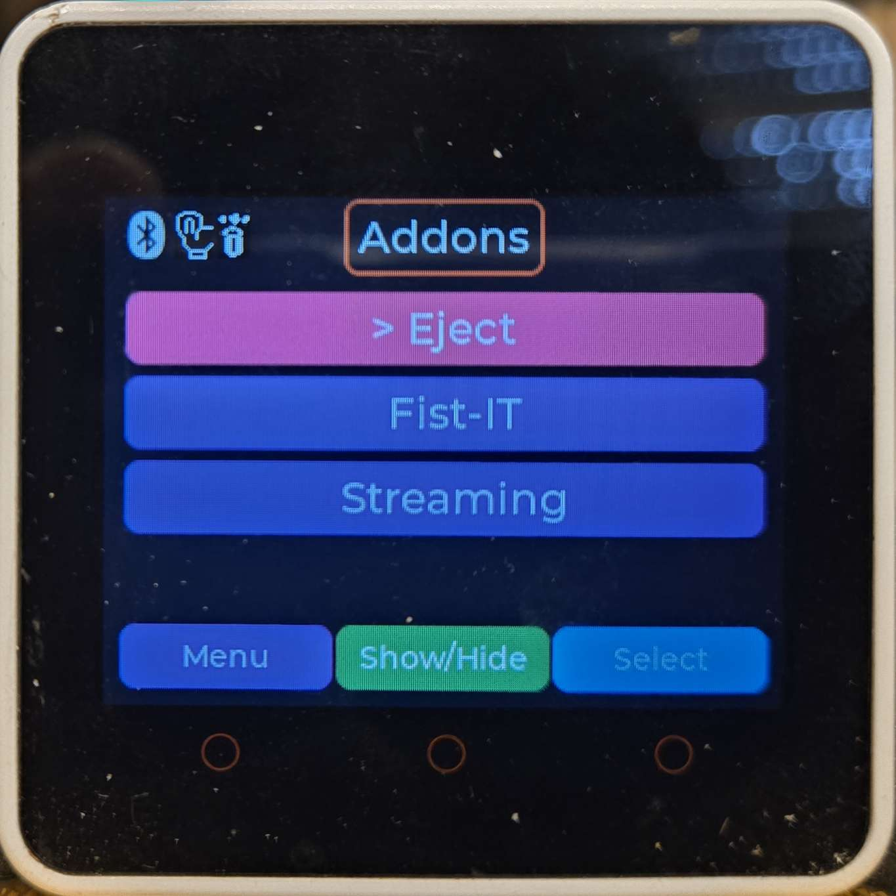

Open or manage addon modules.

Available addons may include:
- Streaming
- Eject
- Fist-IT
- AP-Mode (Advanced Penetration), depending on firmware build (needs OSSM Lite by Frayd)

How to use:
1. Rotate right encoder to select addon.
2. Press middle button to open/toggle mode actions.
3. Press right button to select/open.

Buttons:
- Left: back to Menu
- Middle: mode action (show/hide or select mode)
- Right: open/select addon

---

## Streaming Mode (Experimental)

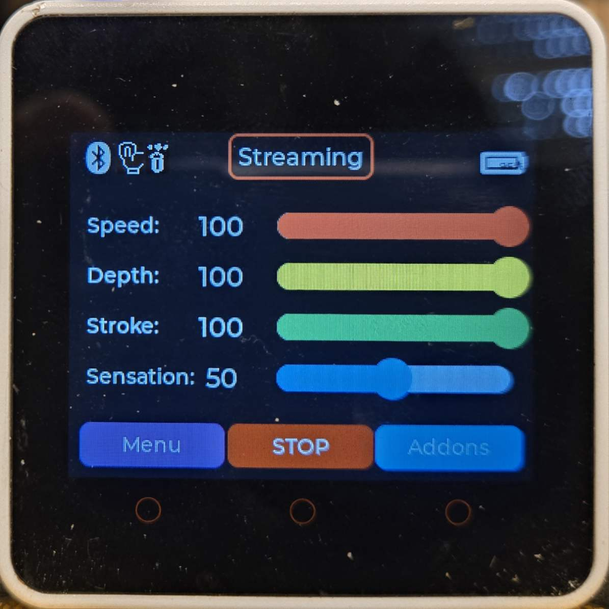

Streaming mode allows external position sources (for example scripts/apps) to control motion.

Startup flow:
1. Open Streaming addon.
2. Remote prepares OSSM mode and safety flow.
3. Streaming becomes active.

Useful screens:
- 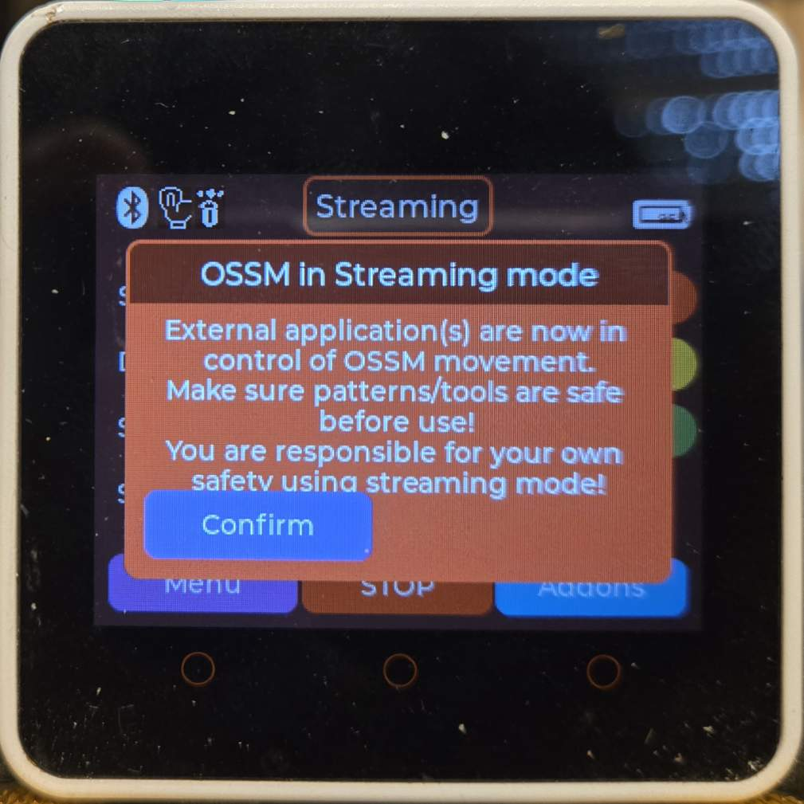
- 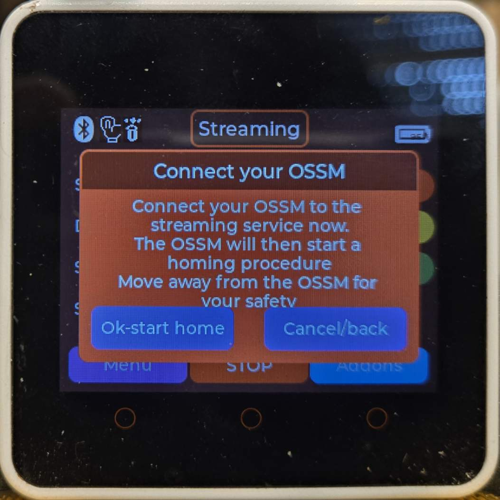
- 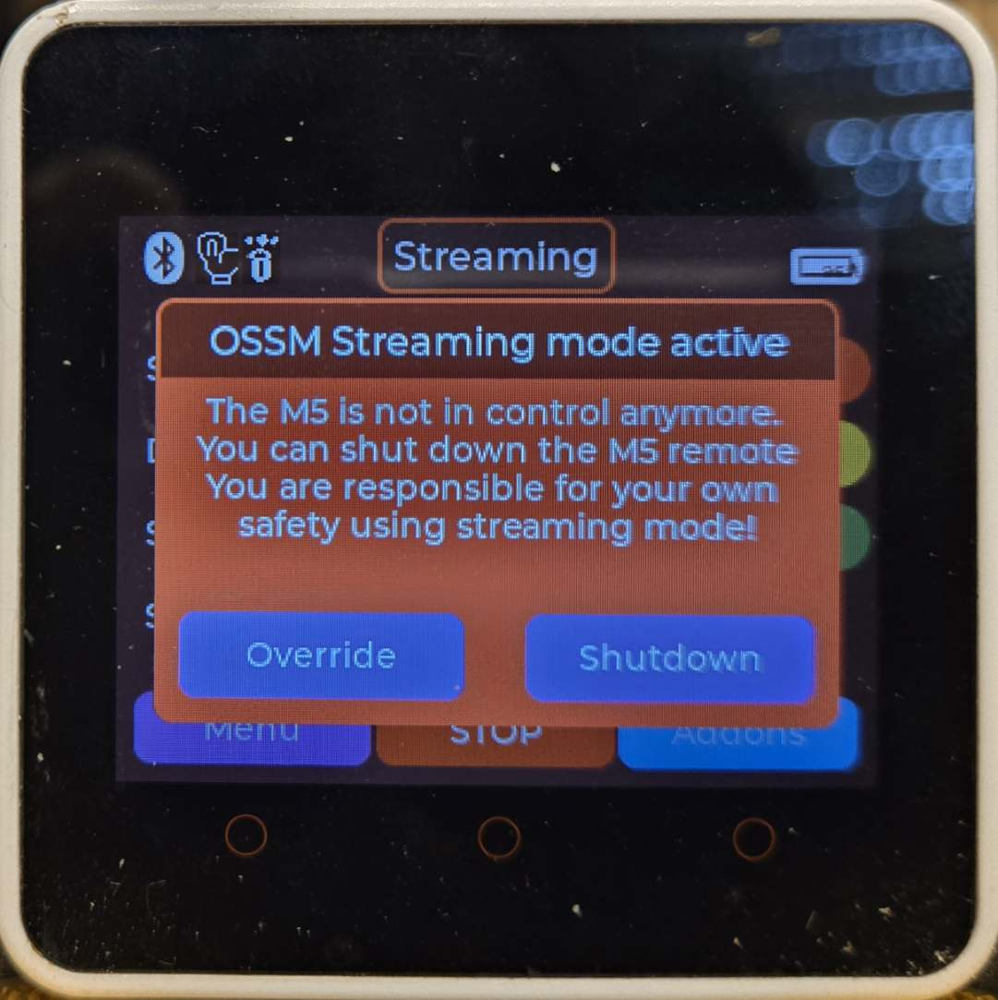

Buttons:
- Left: back
- Middle: pause/resume override
- Right: go to Addons

Important requirement:
- OSSM must support two simultaneous BLE connections.
- Use this firmware file:
	[OSSM-FW-Multiple-BLE-Connections-USE-AT-YOUR-OWN-RISK.bin](../../build/firmware/OSSM%20multiple%20BLE%20Connections%20FW/OSSM-FW-Multiple-BLE-Connections-USE-AT-YOUR-OWN-RISK.bin)

> [!WARNING]
> Streaming mode is still experimental.
> Only use trusted scripts and safe limits.
> You are responsible for safe operation.

---

## Eject Addon

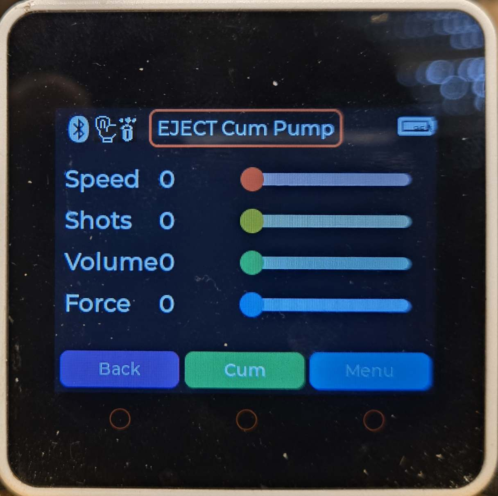

Use Eject to configure and run one-shot pump/squirt sequences.

Set:
- Speed
- Count/time
- Size
- Acceleration

Buttons:
- Left: back
- Middle: run/toggle action
- Right: menu/select action (depends on current flow)

---

## Fist-IT Addon

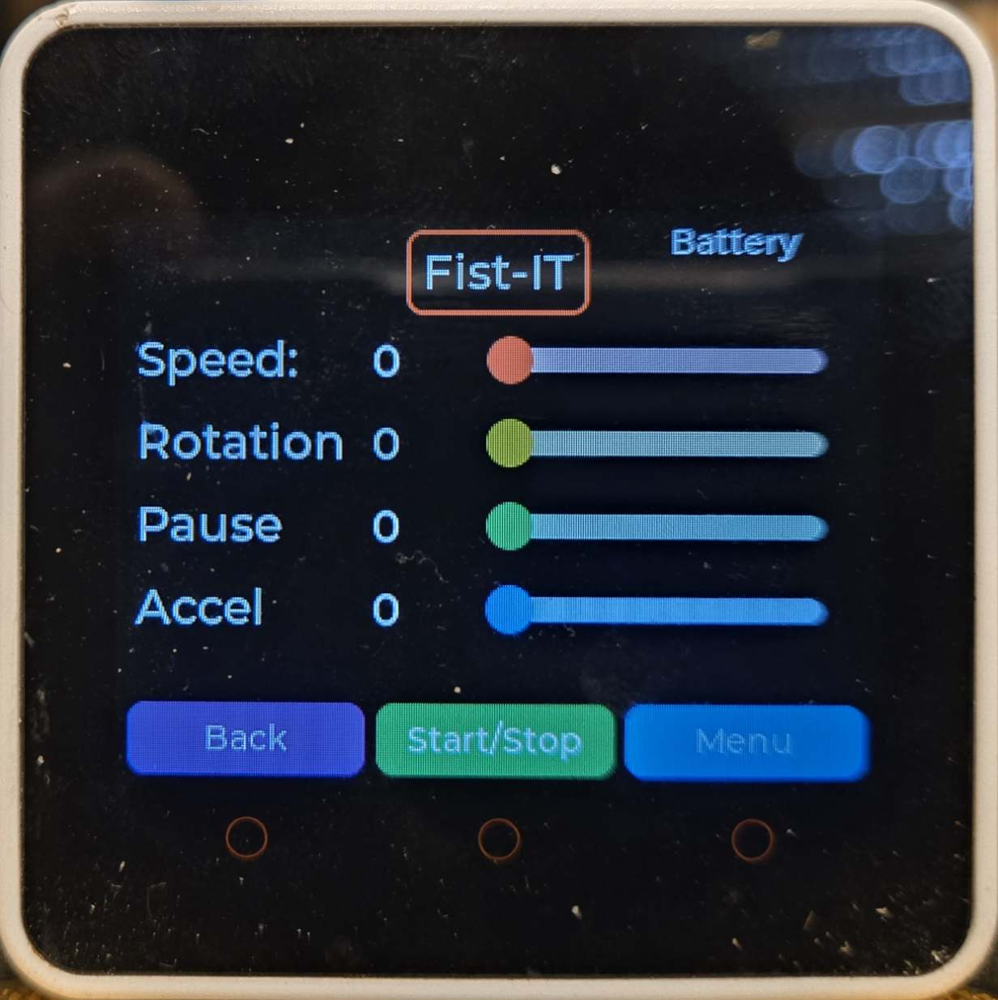

Use Fist-IT controls for paired addon behavior.

Common controls:
- Speed
- Rotation
- Pause
- Acceleration

Buttons:
- Left: back
- Middle: start/stop toggle
- Right: back/menu flow

---

## Advanced Penetration (AP-Mode, Experimental)

AP-Mode is an advanced addon for advanced pattern behavior tuning (base/modifier logic and presets).

What it can do:
- live parameter control
- start/stop with AP logic
- preset apply/save actions

Important requirement:
- AP-Mode needs OSSM Lite firmware created by Frayd.
- Without that compatible firmware, AP will not work!

> [!WARNING]
> AP-Mode is experimental.
> Test slowly with conservative limits before real use.

---

## Safety Checklist (Recommended Every Session)

1. Confirm correct screen and mode before starting movement.
2. Start low: speed/depth/stroke.
3. Verify movement direction and range first.
4. Keep a stop option ready (Middle button / emergency behavior).
5. Do not use experimental features unattended.
6. Never have yourself constrained
7. You alone are responsible for your own safety. Always.
---

## Troubleshooting Quick Tips

- Not connecting:
	- reboot OSSM and remote
	- retry from Start screen
- Movement not matching values after mode change:
	- return to Home and re-check values
	- if needed, stop and re-home flow
- Streaming unavailable:
	- verify two-BLE-connections OSSM firmware is installed
- AP-Mode unavailable/not working:
	- verify Frayd OSSM Lite firmware compatibility

---

## Final Notes

This remote has powerful controls.
Use them with care, test changes gradually, and keep safety first.
